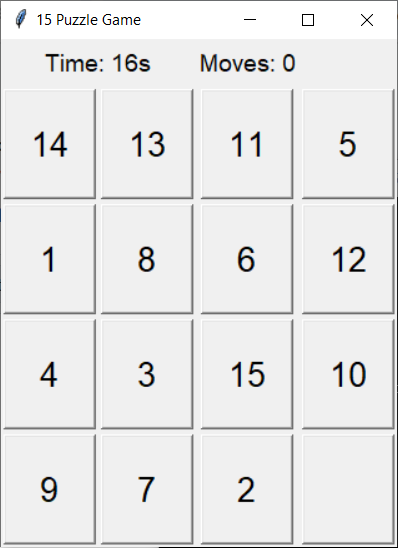

# 15 Puzzle Game

A classic sliding puzzle game (15 Puzzle) implemented in Python using Tkinter for the GUI.  
This project features a playable 4x4 puzzle, move counter, timer, and a hint function powered by the A* search algorithm.

  


## 📦 Features

- **Interactive GUI**: Click tiles to slide them into the empty space.
- **Randomized, always-solvable puzzles**.
- **Move counter** and **timer**.
- **Automatic shuffle after solving**.

## 🧰 Requirements

- Python 3.7+
- Tkinter (usually included with Python)

## 🚀 How to Run

1. Clone or download this repository.
2. Run the game:

   ```sh
   python 15puzzle.py
   ```

## How to Play

- Click on a tile adjacent to the empty space to move it.
- The goal is to arrange the tiles in order from 1 to 15, with the empty space at the end.
- The timer and move counter track your progress.

## 🗂️ Code Structure

- `15puzzle.py`: Main game logic and GUI.
- `PuzzleGame` class handles all game state, GUI, and logic.

## 📜 License

MIT License — feel free to use, modify, and share.


## 👨‍💻 Author  

*Created for educational purposes. Enjoy solving!*  
#Enjoy Coding (Began BALAKRISHNAN) ❤️


